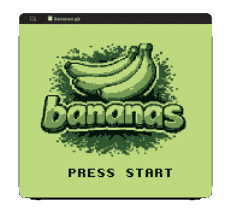

# Bananas

[](https://github.com/mdeclerk/Bananas/actions/workflows/CI.yml)

A 2-player artillery game for the original Game Boy (DMG), inspired by the classic [Gorillas (1991)](https://en.wikipedia.org/wiki/Gorillas_(video_game)). Two kongs, randomized & destructible terrain, ballistic bananas.

<p align="center">
  
  &nbsp;&nbsp;
  
</p>

## Getting Started

```sh
./scripts/init.sh     # one-time Docker build env setup
./scripts/build.sh    # compile → build/bananas.gb
./scripts/play.sh     # launch SameBoy (or mGBA)
```

All scripts are also available as VS Code tasks via **Terminal → Run Task** (Init, Build, Clean, Play, Build & Play).

## How to play

**Controls** — D-pad: aim · A: fire · B: peek at opponent

<p align="center">
  
</p>

## Prerequisites

- Docker (containerized build environment)
- [SameBoy](https://sameboy.github.io/) (GameBoy emulator)
- macOS, Linux, or WSL. Apple Silicon supported (Dockerfile auto-selects arm64 GBDK).

Inside the container: GBDK-2020 4.5.0, `lcc`/SDCC, `png2asset`, `make`.

## Project Structure

```
src/              Source code — gameplay, physics, rendering, input, sfx
assets/           PNG images (auto-converted to GB tile data by png2asset)
build/
  bananas.gb      ROM output
  generated/      auto-generated source code
scripts/          build scripts
Makefile          build rules + asset pipeline
Dockerfile        GBDK build environment
```