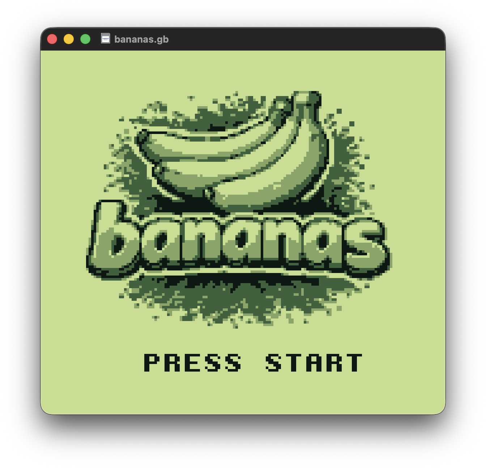
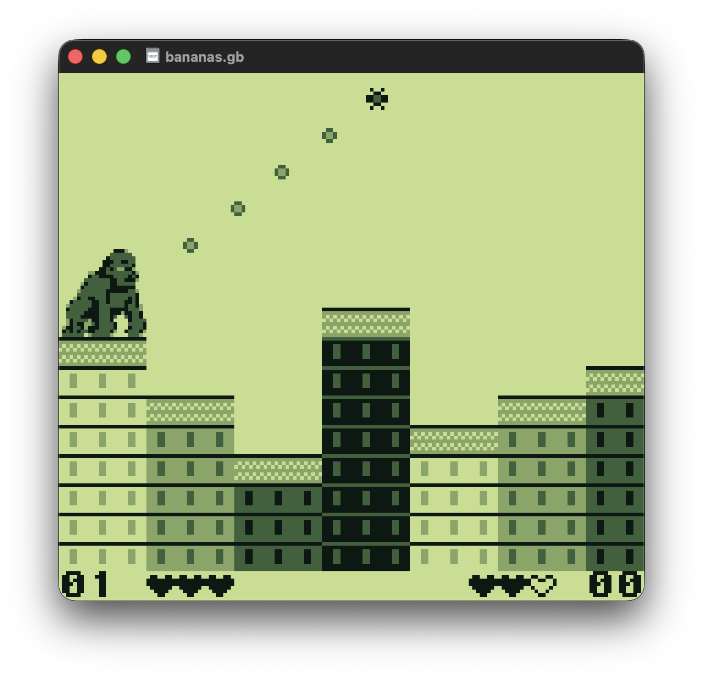
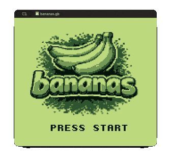

[](https://github.com/mdeclerk/Bananas/actions/workflows/CI.yml)

# Bananas

A 2-player artillery game for the original Game Boy (DMG), inspired by the classic [Gorillas (1991)](https://en.wikipedia.org/wiki/Gorillas_(video_game)). Two kongs, destructible terrain with random layout, ballistic bananas.

<p align="center">
  
  &nbsp;&nbsp;
  
</p>

## TL;DR

Download latest [release ROM](https://github.com/mdeclerk/Bananas/releases/tag/latest/), run with [SameBoy](https://sameboy.github.io/) or [mGBA](https://mgba.io/).

## Prerequisites

- Docker (containerized build environment)
- [SameBoy](https://sameboy.github.io/) (GameBoy emulator)

## Build environment

```sh
./scripts/init.sh             # one-time Docker build env setup
./scripts/build.sh            # release build → build/bananas.gb
./scripts/build.sh DEBUG=1    # debug build with .map + .sym/.noi symbols
./scripts/play.sh             # launch SameBoy with build/bananas.gb
```

All scripts are also available as VS Code tasks via **Terminal → Run Task**.

## How to play

**Controls** — D-pad: aim · A: fire · B: peek at opponent

<p align="center">
  
</p>

## Project Layout

```
src/              Source code — gameplay, physics, rendering, input, sfx
assets/           PNG images (auto-converted to GB tile data by png2asset)
build/
  bananas.gb      ROM output
  generated/      auto-generated source code
scripts/          build scripts
Makefile          build rules + asset pipeline
Dockerfile        GBDK build environment
```
